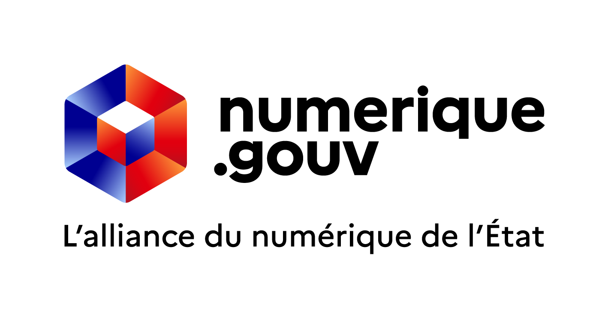
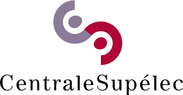

# OpenGateLLM
### **[Documentation](https://docs.opengatellm.org) | [API Reference](https://albert.api.etalab.gouv.fr/reference)**

> [!WARNING]
> **The API is still under beta version, major breaking changes may occur.**

OpenGateLLM is an <b>open-source</b>, <b>production-ready</b> API gateway for Generative AI.

> It centralizes, secures, and governs access to AI models across your organization, enabling teams to focus on building high-value AI applications instead of managing infrastructure complexity and data security risks.

Designed for organizations that require full control over their data and infrastructure, **OpenGateLLM is optimized for self-hosted models**. It provides a sovereign and cost-effective foundation to deploy, manage, and scale Generative AI securely — without vendor lock-in.

> [!TIP]
> **OpenGateLLM, as API gateway, is an alternative to LiteLLM, TensorZero, OpenRouter and others, dedicated to self-hosted IA infrastructure.**

## 🔥 Challenges

OpenGateLLM addresses three critical challenges for organizations:
1. **Accelerate AI adoption** – Remove barriers to integrating AI within your organization
2. **Cost control** - Reduce expenses of commercial APIs and GPU infrastructure by using self-hosted models and build a mutualized infrastructure with your peers without vendor lock-in.
3. **Data sovereignty** - Keep sensitive data under your control
4. **Privacy & security** - No chat history storage, robust access control

## ⚡️ Core principles

- **Open source and free forever** - All features available without commercial licensing
- **High code quality** - Built with maintainability and reliability in mind
- **Lightweight architecture** - Focused feature set for optimal performance
- **High compatibility** - Seamlessly integrates with GenAI ecosystem frameworks by OpenAI-compatible API
- **Production-ready** - Engineered to handle high loads with advanced QoS features

## 🚀 Quickstart

Deploy and start using OpenGateLLM in minutes with our quickstart guide [here](https://docs.opengatellm.org/getting-started/quickstart).

## 🤝 Contribute

This project exists thanks to all the people who contribute. OpenGateLLM thrives on open-source contributions. Join our community! 

Check out our [Contribution Guide](https://docs.opengatellm.org/contributing) to get started.

## 🏔️ Roadmap

OpenGateLLM is still under *beta version*, major breaking changes may occur. Check our current roadmap [here](https://github.com/etalab-ia/OpenGateLLM/milestone/4) to see what we are working on.

## 🎖️ Sponsors

  <ul align="center" style="list-style: none">

  </ul>

