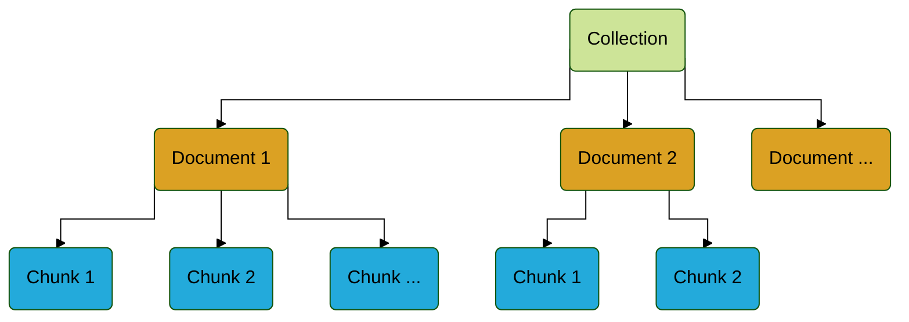
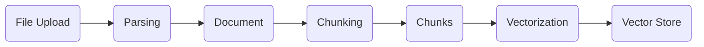
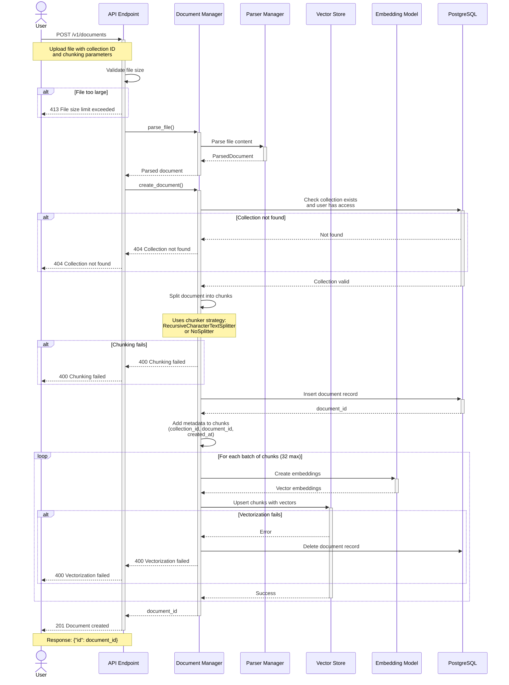

import Tabs from '@theme/Tabs';
import TabItem from '@theme/TabItem';

# Document Management

OpenGateLLM provides a comprehensive document management system to help you perform Retrieval-Augmented Generation (RAG). This allows you to store, process, and search through your documents to enhance AI responses with relevant context.

## What is RAG?

Retrieval-Augmented Generation (RAG) is a technique that combines a language model with an external knowledge source. Instead of relying only on its internal training data, the model first retrieves relevant information from a database or document store, then uses that context to generate more accurate, up-to-date, and domain-specific responses.

## Prerequisites

To use document management features, you need to configure a vector store. OpenGateLLM supports two vector databases:
- [Qdrant](https://qdrant.tech/documentation/guides/installation/#docker-and-docker-compose)
- [Elasticsearch](https://www.elastic.co/docs/deploy-manage/deploy/self-managed/install-elasticsearch-with-docker)

For detailed setup instructions, see the [Vector Store documentation](../../dependencies/vector_store.md).

## Concepts

Document management organizes data in a hierarchical structure with three main entities:

- **[Collection](./collections.md)**: Storage space for documents and chunks
- **Document**: Text extracted from a file
- **Chunk**: A portion of text split from a document

## How it Works

OpenGateLLM allow to upload files and process them into documents and chunks. Chunks are the smallest units in the vector store, representing portions of text from documents. Each chunk is vectorized and can be retrieved during [search operations](./rag.md) to add more context of you LLM requests. When you import a file, it goes through multiple phases:

1. **File**: The original file (PDF, JSON, Markdown, HTML, etc.)
2. **Parsing**: Text extraction from the file
3. **Document**: Extracted text with metadata
4. **Chunking**: Splitting the document into smaller pieces
5. **Chunks**: Text portions with their vectors
6. **Vectorization**: Converting chunks to embeddings using an embedding model
7. **Indexation**: Storing chunks and vectors in the database

When you upload a file to create a document, the system processes it through multiple stages involving validation, parsing, chunking, vectorization, and storage. Here's the complete flow:

The processing involves several key components:

- **API Endpoint**: Handles HTTP requests and validation
- **Document Manager**: Orchestrates the document creation process
- **Parser Manager**: Extracts text from various file formats (PDF, JSON, Markdown, HTML)
- **Vector Store**: Stores chunks and their vector embeddings (Qdrant or Elasticsearch)
- **Embedding Model**: Converts text chunks into vector representations
- **PostgreSQL**: Stores document metadata and relationships
