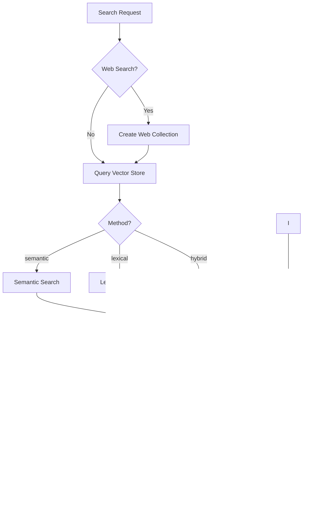

import Tabs from '@theme/Tabs';
import TabItem from '@theme/TabItem';

# Retrieval-Augmented Generation (RAG)

RAG (Retrieval-Augmented Generation) search allows you to retrieve relevant chunks from your [collections](./collections.md) based on a query. This enables language models to generate responses grounded in your specific documents and knowledge base.

## Search Methods

OpenGateLLM supports multiple search methods:

| Method | Description |
| --- | --- |
| `semantic` | Vector similarity search using embeddings |
| `lexical` | Keyword-based search (BM25) |
| `hybrid` | Combination of semantic and lexical search |

## Search Parameters

- `prompt`: Search query (required)
- `collections`: List of collection IDs to search in (required)
- `method`: Search method (default: `semantic`)
- `limit`: Number of results to return (default: 10, max: 200)
- `offset`: Pagination offset (default: 0)
- `rff_k`: RRF constant for hybrid search (default: 20)
- `score_threshold`: Minimum similarity score (0.0-1.0, only for semantic)

## Search Flow

[//]: # TODO - Update Mermaid Graph to remove web search


## Performing Searches

<Tabs>
  <TabItem value="Semantic search" label="Semantic search" default>
  ```bash
  curl -X POST http://localhost:8000/v1/search \
    -H "Authorization: Bearer <api_key>" \
    -H "Content-Type: application/json" \
    -d '{
      "prompt": "What is machine learning?",
      "collections": [1, 2],
      "method": "semantic",
      "limit": 10,
      "score_threshold": 0.7
    }'
  ```
  </TabItem>
  <TabItem value="Hybrid search" label="Hybrid search">
  ```bash
  curl -X POST http://localhost:8000/v1/search \
    -H "Authorization: Bearer <api_key>" \
    -H "Content-Type: application/json" \
    -d '{
      "prompt": "Python programming",
      "collections": [1],
      "method": "hybrid",
      "limit": 10,
      "rff_k": 20
    }'
  ```
  </TabItem>
  <TabItem value="Web search" label="With web search">
  ```bash
  curl -X POST http://localhost:8000/v1/search \
    -H "Authorization: Bearer <api_key>" \
    -H "Content-Type: application/json" \
    -d '{
      "prompt": "Latest AI developments",
      "collections": [1],
      "method": "semantic",
      "limit": 10
    }'
  ```
  </TabItem>
</Tabs>

:::info
See [Configuration](../../getting-started/configuration.md) for more details.
:::

## Next Steps

- Learn how to create and manage collections: [Collections](./collections.md)
- Learn how to import and process documents: [Parsing and Chunking](./parsing-and-chunking.md)

