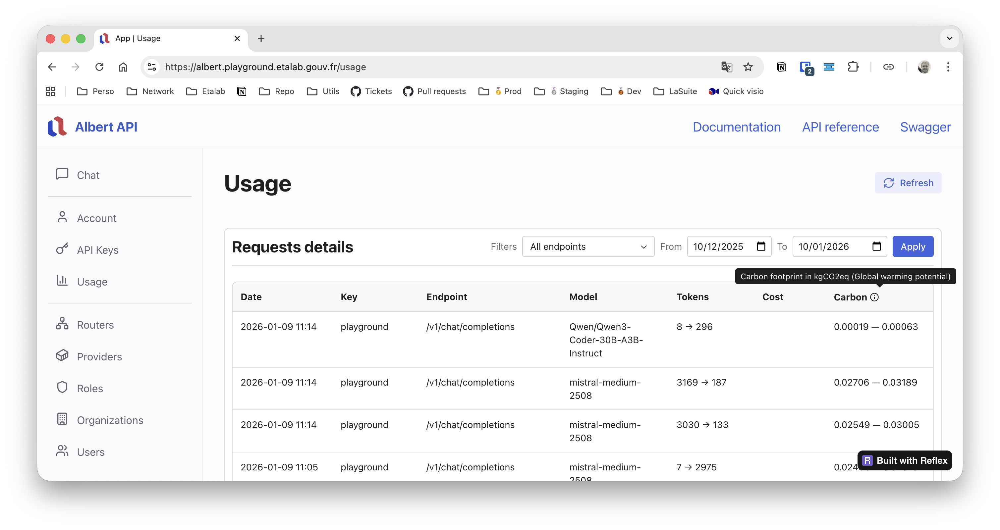

import Tabs from '@theme/Tabs';
import TabItem from '@theme/TabItem';

# Environmental footprint

OpenGateLLM tracks the environmental impact of AI model usage through the [EcoLogits](https://ecologits.ai) library, which provides a comprehensive view of the environmental footprint of generative AI models at inference.

## Model carbon footprint configuration

For each model provider, you can define the carbon footprint parameters. Either through the *Provider settings* page in the Playground UI, or via the `config.yml` file. For more details on model configuration, see the [model addition documentation](../models/configuration.md).


<Tabs>
  <TabItem value="playground" label="By Playground UI" default>

For each model provider, you can define the carbon footprint parameters in the *Provider settings* page of the Playground. The form fields includes the number of total and active parameters (in billions), as well as the hosting zone. 


</TabItem>
  <TabItem value="config" label="By configuration file" default>

For each model provider, you can define the carbon footprint parameters in the `config.yml` file. The following parameters are used for carbon footprint computation:
- `model_total_params`
- `model_active_params`
- `model_hosting_zone`

For more information, see [Configuration](../getting-started/configuration.md) documentation.

**Example:**

```yaml
models:
  [...]
  - name: my-language-model
    type: text-generation
    providers:
      - type: openai
        url: https://api.openai.com
        key: ${OPENAI_API_KEY}
        model_name: gpt-4o-mini
        model_total_params: 35
        model_active_params: 35
        model_hosting_zone: WOR
```

</TabItem>
</Tabs>

:::info
Carbon footprint computation requires `model_total_params` and `model_active_params` to be defined. If not provided, the environmental impact will not be computed for that model provider (display as 0 kWh and 0 kgCO2eq).

Carbon footprint is only supported for `text-generation` and `image-text-to-text` model types. For other model types, the environmental impact will not be computed (display as 0 kWh and 0 kgCO2eq).
:::


## Environmental impact metrics

For each call to a generative AI model, the API returns environmental impact metrics in the response, in the `usage.carbon` field. The metrics include minimum and maximum estimates to account for variability in model efficiency:

- **kWh**: Energy consumption in kilowatt-hours (kWh), representing the final electricity consumption.
- **kgCO2eq**: Global Warming Potential (GWP) in kilograms of CO2 equivalent (kgCO2eq), representing greenhouse gas emissions related to climate change.

**Example response:**

```json
{
  "id": "chatcmpl-123",
  "object": "chat.completion",
  "created": 1677652288,
  "model": "my-language-model",
  "choices": [
    {
      "index": 0,
      "message": {
        "role": "assistant",
        "content": "Hello! How can I help you today?"
      },
      "finish_reason": "stop"
    }
  ],
  "usage": {
    "prompt_tokens": 10,
    "completion_tokens": 20,
    "total_tokens": 30,
    "cost": 0.000015,
    "carbon": {
      "kWh": {
        "min": 0.0001234,
        "max": 0.0001456
      },
      "kgCO2eq": {
        "min": 0.0000567,
        "max": 0.0000672
      }
    }
  }
}
```

After the request is processed, the carbon footprint of the request is store in *usage* table by the [hooks decorator](https://github.com/etalab-ia/OpenGateLLM/blob/main/api/utils/hooks_decorator.py) attached to each endpoint. See [usage monitoring documentation](./usage.md) for more information. 

You can also see the carbon footprint of the request in the *Usage* page of the Playground.



## How it works

Environmental impact is calculated using the [EcoLogits](https://ecologits.ai) library through the `compute_llm_impacts` function. The computation takes into account:

1. **Model parameters**: 
   - Total number of parameters (`model_total_params`)
   - Active number of parameters (`model_active_params`, defaults to total params if not specified)

2. **Token usage**: The number of output/completion tokens generated by the model

3. **Request latency**: The time taken for the inference request (in seconds)

4. **Electricity mix**: The carbon intensity of electricity based on the hosting zone (`model_hosting_zone`). The electricity mix includes:
   - ADPE (Abiotic Depletion Potential - elements)
   - PE (Primary Energy)
   - GWP (Global Warming Potential)

For more information about methodology, see [EcoLogits documentation](https://ecologits.ai/methodology).

:::note
If `total_params` is not defined or `token_count` is zero, the carbon footprint will be returned as zero for both energy and emissions.
:::

