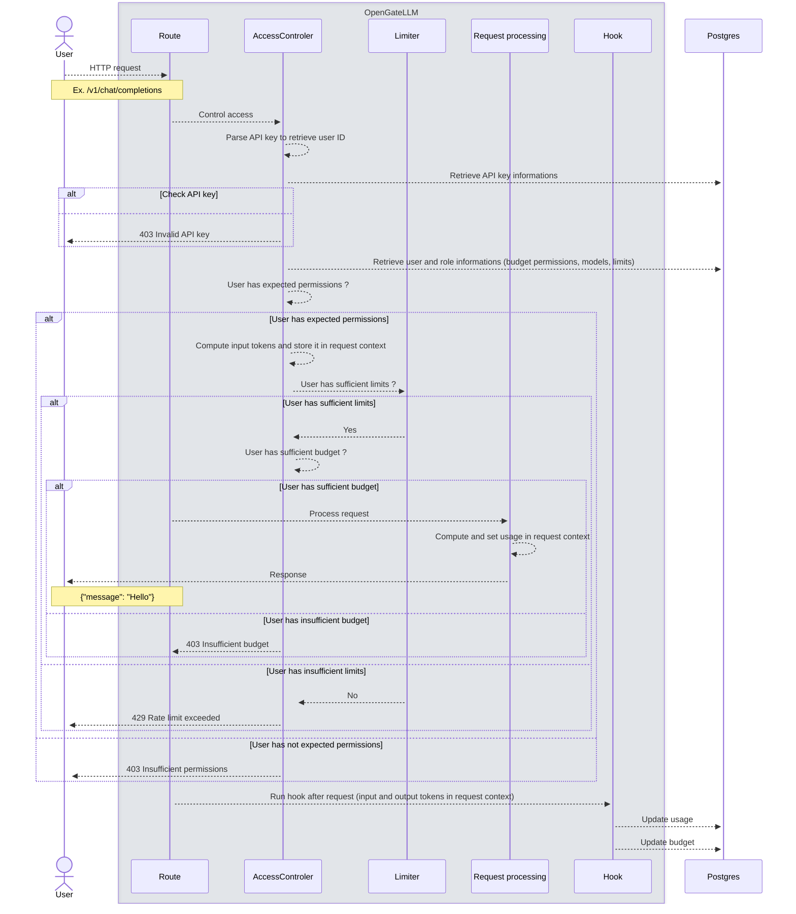

import Tabs from '@theme/Tabs';
import TabItem from '@theme/TabItem';

# Identity and Access Management

OpenGateLLM implements a comprehensive security system based on users, roles, organizations, and permissions. This documentation explains how to manage identity and access within the system.

:::info
All IAM management endpoints require the `admin` permission.
:::

## Overview

The security model consists of four main components:

- **[Roles](./roles-and-permissions.md)**: Define sets of permissions and usage limits
- **[Users](./organizations-projects-users.md#user-management)**: Entities that can access the API with assigned roles
- **[API Keys](./api-keys.md)**: Authenticate user requests to the API
- **[Organizations](./organizations-projects-users.md#organization-management)**: Groups of users for organizational purposes

## Master key configuration

The master key is a special API key defined in the `config.yml` file under the `settings` section:

```yaml
settings:
  [...]
  auth_master_key: 'changeme'
  auth_key_max_expiration_days: 365
  auth_playground_session_duration: 3600
```

The following parameters are used for authentication:
- `auth_master_key`: The master API key for administrative access
- `auth_key_max_expiration_days`: Maximum number of days an API key can be valid
- `auth_playground_session_duration`: Session duration in seconds for playground access

For more information, see [Configuration](../../getting-started/configuration.md) documentation.

:::warning
If you modify the master key, you'll need to update all user API keys since they're encrypted using this key. The master key should be at least 32 characters long in production.
:::

## How it works

When a user makes a request, the following sequence diagram shows the process:


