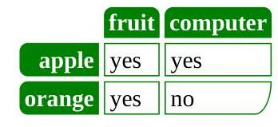
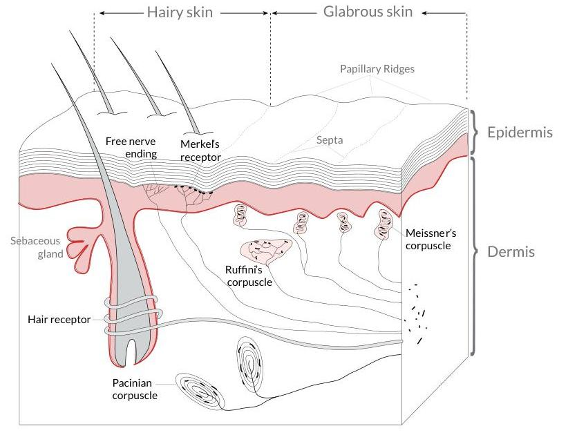

import Tabs from '@theme/Tabs';
import TabItem from '@theme/TabItem';

# Optical Character Recognition (OCR)
<p align="right">
[](https://colab.research.google.com/github/etalab-ia/opengatellm/blob/main/docs/tutorials/ocr.ipynb)
</p>


OpenGateLLM provides an OCR endpoint based on the Mistral API convention, `/v1/ocr`. For more information on the Mistral API convention, please refer to their [documentation](https://docs.mistral.ai/api/endpoint/ocr).


:::warning
For the following tutorial, we use [DINUM](https://www.numerique.gouv.fr/) instance of OpenGateLLM, called [Albert API](https://albert.api.etalab.gouv.fr/swagger). If your are not a user of this instance, please refer to the [OpenGateLLM readme](https://github.com/etalab-ia/OpenGateLLM?tab=readme-ov-file#-tutorials--guides) to install and configure your own instance. You need to have a image-to-text model to run this tutorial.

:::


```python
%pip install -qU mistralai requests datasets pillow

import base64
import os
from urllib.parse import urljoin

from IPython.display import Image, display
from mistralai import Mistral
import requests
```

First, setup your API key and server URL. You can set the `ALBERT_API_KEY` environment variable or provide it directly, then initialize the Mistral client and a requests session.


```python
server_url = "https://albert.api.etalab.gouv.fr"
api_key = os.getenv("ALBERT_API_KEY")

session = requests.Session()
session.headers.update({"Authorization": f"Bearer {api_key}"})
client = Mistral(server_url=server_url, api_key=api_key)
```

Find a audio model with `/v1/models` endpoint to perform OCR. Theses models have the type `image-to-text`.


```python
response = session.get(url=urljoin(server_url, "/v1/models"))
assert response.status_code == 200
models = response.json()["data"]


model = [model for model in models if model["type"] == "image-to-text"][0]["id"]
print(f"OCR model found: {model}")
```


> ```python
> OCR model found: mistral-ocr-2505
> ```


## OCR your PDF Documents

### OCR with a PDF URL

<Tabs>
<TabItem value="with-mistral-client" label="With Mistral client">


```python
url = "https://www.princexml.com/samples/magic6/magic.pdf"
response = client.ocr.process(model=model, document={"type": "document_url", "document_url": url}, include_image_base64=True)

print(f"Page 0 - markdown:\n\n{response.pages[0].markdown[:200]}\n[...]\n")
print(
    f"Page 0 - image 0 (box: {response.pages[0].images[0].top_left_x}, {response.pages[0].images[0].top_left_y}, {response.pages[0].images[0].bottom_right_x}, {response.pages[0].images[0].bottom_right_y})"
)
display(Image(data=base64.b64decode(response.pages[0].images[0].image_base64.split(",")[1])))
```


> ```python
> Page 0 - markdown:
> 
> # The magic of Prince 
> 
> Prince is a computer program that converts XML and HTML into PDF. It is simple, yet very powerful, and it creates beautiful documents. The purpose of this small document is to 
> [...]
> 
> Page 0 - image 0 (box: 429, 1790, 777, 1949)
> ```
> 


</TabItem>
<TabItem value="with-requests" label="With requests">


```python
url = "https://www.princexml.com/samples/magic6/magic.pdf"
response = requests.post(
    url=f"{server_url}/v1/ocr",
    headers={"Authorization": f"Bearer {api_key}"},
    json={"model": model, "document": {"type": "document_url", "document_url": url}, "include_image_base64": True},
)
response = response.json()

print(f"Page 0 - markdown:\n\n{response["pages"][0]["markdown"][:200]}\n[...]\n")
print(
    f"Page 0 - image 0 (box: {response["pages"][0]["images"][0]["top_left_x"]}, {response["pages"][0]["images"][0]["top_left_y"]}, {response["pages"][0]["images"][0]["bottom_right_x"]}, {response["pages"][0]["images"][0]["bottom_right_y"]})"
)
display(Image(data=base64.b64decode(response["pages"][0]["images"][0]["image_base64"].split(",")[1])))
```


> ```python
> Page 0 - markdown:
> 
> # The magic of Prince 
> 
> Prince is a computer program that converts XML and HTML into PDF. It is simple, yet very powerful, and it creates beautiful documents. The purpose of this small document is to 
> [...]
> 
> Page 0 - image 0 (box: 433, 1790, 777, 1949)
> ```
> 


</TabItem>
</Tabs>

### OCR with a base64 encoded PDF

<Tabs>
<TabItem value="with-mistral-client" label="With Mistral client">


```python
# Download the PDF and encode it to base64
pdf_url = "https://www.princexml.com/samples/textbook/somatosensory.pdf"
pdf_response = requests.get(pdf_url)
pdf_response.raise_for_status()
pdf_base64 = base64.b64encode(pdf_response.content).decode("utf-8")
print(f"Downloaded PDF ({len(pdf_response.content)} bytes) and encoded to base64")

# Process OCR
response = client.ocr.process(
    model=model, document={"type": "document_url", "document_url": f"data:application/pdf;base64,{pdf_base64}"}, include_image_base64=True
)

print(f"\nPage 0 - markdown:\n\n{response.pages[0].markdown[:200]}\n[...]\n")
if response.pages[0].images:
    print(
        f"Page 0 - image 0 (box: {response.pages[0].images[0].top_left_x}, {response.pages[0].images[0].top_left_y}, {response.pages[0].images[0].bottom_right_x}, {response.pages[0].images[0].bottom_right_y})"
    )
    display(Image(data=base64.b64decode(response.pages[0].images[0].image_base64.split(",")[1])))
```


> ```python
> Downloaded PDF (135171 bytes) and encoded to base64
> 
> Page 0 - markdown:
> 
> # Anatomy of the Somatosensory System 
> 
> From WIKIbOOKs ${ }^{1}$
> 
> Our somatosensory system consists of sensors in the skin and sensors in our muscles, tendons, and joints. The receptors in the skin, t
> [...]
> 
> Page 0 - image 0 (box: 143, 1075, 965, 1705)
> ```
> 


</TabItem>
<TabItem value="with-requests" label="With requests">


```python
# Option 2 - with requests
response = requests.post(
    url=f"{server_url}/v1/ocr",
    headers={"Authorization": f"Bearer {api_key}"},
    json={
        "model": model,
        "document": {"type": "document_url", "document_url": f"data:application/pdf;base64,{pdf_base64}"},
        "include_image_base64": True,
    },
)
response = response.json()

print(f"Page 0 - markdown:\n\n{response["pages"][0]["markdown"][:200]}\n[...]\n")
if response["pages"][0].get("images"):
    print(
        f"Page 0 - image 0 (box: {response["pages"][0]["images"][0]["top_left_x"]}, {response["pages"][0]["images"][0]["top_left_y"]}, {response["pages"][0]["images"][0]["bottom_right_x"]}, {response["pages"][0]["images"][0]["bottom_right_y"]})"
    )
    display(Image(data=base64.b64decode(response["pages"][0]["images"][0]["image_base64"].split(",")[1])))
```


> ```python
> Page 0 - markdown:
> 
> # Anatomy of the Somatosensory System 
> 
> From WIKIbOOKs ${ }^{1}$
> 
> Our somatosensory system consists of sensors in the skin and sensors in our muscles, tendons, and joints. The receptors in the skin, t
> [...]
> 
> Page 0 - image 0 (box: 143, 1075, 965, 1705)
> ```
> 


</TabItem>
</Tabs>

## OCR your images

### OCR with a image URL

<Tabs>
<TabItem value="with-mistral-client" label="With Mistral client">


```python
image_url = "https://upload.wikimedia.org/wikipedia/commons/thumb/0/0b/ReceiptSwiss.jpg/1280px-ReceiptSwiss.jpg"

response = client.ocr.process(model=model, document={"type": "image_url", "image_url": image_url}, include_image_base64=True)

print(f"Markdown:\n\n{response.pages[0].markdown[:200]}\n[...]\n")
```


> ```python
> Markdown:
> 
> Berghotel
> Grosse Scheidegg
> 3818 Grindelwald
> Familie R.Müller
> 
> Rech. Nr. 4572 30.07.2007/13:29:17
> Bar Tisch 7/01
> 
> 2xLatte Macchiato à 4.50 CHF 9.00
> 1xGloki à 5.00 CHF 5.00
> 1xSchweinschnitzel à 22.00 CH
> [...]
> 
> ```


</TabItem>
<TabItem value="with-requests" label="With requests">


```python
image_url = "https://upload.wikimedia.org/wikipedia/commons/thumb/0/0b/ReceiptSwiss.jpg/1280px-ReceiptSwiss.jpg"
response = requests.post(
    url=f"{server_url}/v1/ocr",
    headers={"Authorization": f"Bearer {api_key}"},
    json={"model": model, "document": {"type": "image_url", "image_url": image_url}, "include_image_base64": True},
)
response = response.json()

print(f"Markdown:\n\n{response["pages"][0]["markdown"][:200]}\n[...]\n")
```


> ```python
> Markdown:
> 
> Berghotel
> Grosse Scheidegg
> 3818 Grindelwald
> Familie R.Müller
> 
> Rech. Nr. 4572 30.07.2007/13:29:17
> Bar Tisch 7/01
> 
> 2xLatte Macchiato à 4.50 CHF 9.00
> 1xGloki à 5.00 CHF 5.00
> 1xSchweinschnitzel à 22.00 CH
> [...]
> 
> ```


</TabItem>
</Tabs>

### OCR with a base64 encoded image

<Tabs>
<TabItem value="with-mistral-client" label="With Mistral client">


```python
# Download an image and encode it to base64
image_url = "https://ocr.space/Content/Images/receipt-ocr-original.webp"
image_response = requests.get(image_url)
image_response.raise_for_status()

# Encode image bytes directly to base64 (no PIL needed)
image_base64 = base64.b64encode(image_response.content).decode("utf-8")
print(f"Downloaded image and encoded to base64 ({len(image_base64)} characters)")

# Process OCR
response = client.ocr.process(model=model, document={"type": "image_url", "image_url": image_url}, include_image_base64=True)

print(f"\nMarkdown:\n\n{response.pages[0].markdown[:200]}\n[...]\n")
if response.pages[0].images:
    print(
        f"Image 0 (box: {response.pages[0].images[0].top_left_x}, {response.pages[0].images[0].top_left_y}, {response.pages[0].images[0].bottom_right_x}, {response.pages[0].images[0].bottom_right_y})"
    )
    display(Image(data=base64.b64decode(response.pages[0].images[0].image_base64.split(",")[1])))
```


> ```python
> Downloaded image and encoded to base64 (151020 characters)
> 
> Markdown:
> 
> # Walmart
> Save money. Live better.
> (330) 339 - 3991
> MANAGER DIANA EARNEST
> 231 BLUEBELL DR SW
> NEW PHILADELPHIA OH 44663
> ST# 02115 OP# 009044 TE# 44 TR# 01301
> PET TOY 004747571658 1.97 X
> FLOPPY PUPPY 00
> [...]
> 
> ```


</TabItem>
<TabItem value="with-request" label="With request">


```python
# Download an image and encode it to base64
image_url = "https://ocr.space/Content/Images/receipt-ocr-original.webp"
image_response = requests.get(image_url)
image_response.raise_for_status()

# Encode image bytes directly to base64 (no PIL needed)
image_base64 = base64.b64encode(image_response.content).decode("utf-8")
print(f"Downloaded image and encoded to base64 ({len(image_base64)} characters)")

# Process OCR
response = requests.post(
    url=f"{server_url}/v1/ocr",
    headers={"Authorization": f"Bearer {api_key}"},
    json={"model": model, "document": {"type": "image_url", "image_url": image_url}, "include_image_base64": True},
)
response = response.json()

print(f"\nMarkdown:\n\n{response["pages"][0]["markdown"][:200]}\n[...]\n")
```


> ```python
> Downloaded image and encoded to base64 (151020 characters)
> 
> Markdown:
> 
> # Walmart
> Save money. Live better.
> (330) 339 - 3991
> MANAGER DIANA EARNEST
> 231 BLUEBELL DR SW
> NEW PHILADELPHIA OH 44663
> ST# 02115 OP# 009044 TE# 44 TR# 01301
> PET TOY 004747571658 1.97 X
> FLOPPY PUPPY 00
> [...]
> 
> ```


</TabItem>
</Tabs>

