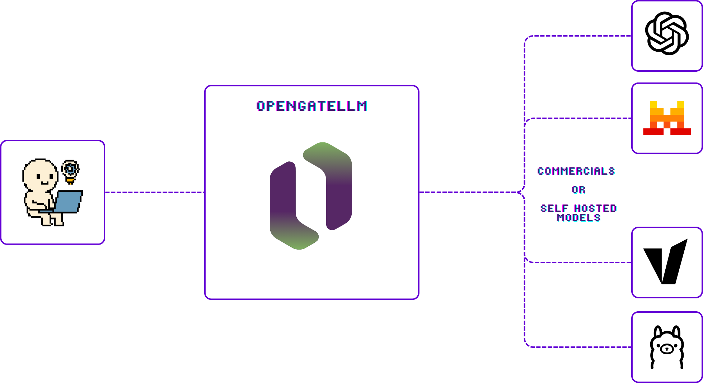

import ContributorsStatic from '@site/src/components/ContributorsStatic';

# OpenGateLLM documentation

Welcome to the OpenGateLLM official documentation! This comprehensive guide will walk you through 
everything you need to know to run, configure, and extend OpenGateLLM. 

:::warning
The API is still under beta version, major breaking changes may occur.
:::

## What is OpenGateLLM?

OpenGateLLM is an open-source, production-ready API gateway, optimized for self-hosted models. It's designed to centralize, secure, and manage Generative AI access in a sovereign and cost-effective way.

OpenGateLLM addresses three critical challenges for organizations:
1. **Cost control** - Reduce expenses of commercial APIs and GPU infrastructure by using self-hosted models and build a mutualized infrastructure with your peers.
2. **Data sovereignty** - Keep sensitive data under your control
3. **Privacy & security** - No chat history storage, robust access control

**Core principles**

- Open source and free forever - All features available without commercial licensing
- High code quality - Built with maintainability and reliability in mind
- Lightweight architecture - Focused feature set for optimal performance
- High compatibility - Seamlessly integrates with GenAI ecosystem frameworks by OpenAI-compatible API
- Production-ready - Engineered to handle high loads with advanced QoS features

**OpenGateLLM is an alternative to...**

<table>
    <thead>
        <tr>
            <th style={{width: '58%', textAlign: 'center', fontWeight: 'bold'}}>Key features</th>
            <th style={{width: '14%', textAlign: 'center', fontWeight: 'bold'}}>OpenGateLLM</th>
            <th style={{width: '14%', textAlign: 'center', fontWeight: 'bold'}}>LiteLLM</th>
            <th style={{width: '14%', textAlign: 'center', fontWeight: 'bold'}}>TensorZero</th>
        </tr>
    </thead>
    <tbody>
        <tr><td>:electric_plug: OpenAI Compatibility</td><td>✅</td><td>✅</td><td>✅</td></tr>
        <tr><td>:open_book: [Open-source](https://github.com/etalab-ia/OpenGateLLM)</td><td>✅</td><td>✅</td><td>✅</td></tr>
        <tr><td>:computer: [Self-hostable](./getting-started/quickstart.md)</td><td>✅</td><td>✅</td><td>✅</td></tr>
        <tr><td>:money_with_wings: **Free (all features)**</td><td>✅</td><td>❌</td><td>✅</td></tr>
        <tr><td>:factory: Support commercial and self-hosted models</td><td>✅</td><td>✅</td><td>✅</td></tr>
        <!-- User management -->
        <tr><td colSpan={4} style={{textAlign: 'center', fontWeight: 'bold'}}>Account management</td></tr>
        <tr><td>:game_die: Playground UI</td><td>✅</td><td>✅</td><td>✅</td></tr>
        <tr><td>:bust_in_silhouette: User management (API keys, budget...)</td><td>✅</td><td>✅</td><td>✅</td></tr>
        <tr><td>:office: Organization management</td><td>🚧</td><td>✅</td><td>❌</td></tr>
        <tr><td>:pencil2: Project management</td><td>🔜</td><td>✅</td><td>❌</td></tr>
        <tr><td>:key: SSO support</td><td>🚧</td><td>✅</td><td>❌</td></tr>
        <!-- High load optimization -->
        <tr><td colSpan={4} style={{textAlign: 'center', fontWeight: 'bold'}}>High load features</td></tr>
        <tr><td>:hourglass: Rate limiting</td><td>✅</td><td>❌</td><td>❌</td></tr>
        <tr><td>:zap: Requests prioritization</td><td>✅</td><td>✅</td><td>❌</td></tr>
        <tr><td>:chart_with_upwards_trend: Quality of service thresholds</td><td>✅</td><td>✅</td><td>❌</td></tr>
        <tr><td>:twisted_rightwards_arrows: Model load balancing</td><td>✅</td><td>✅</td><td>❌</td></tr>
        <tr><td>:arrows_counterclockwise: Model fallback</td><td>🔜</td><td>✅</td><td>❌</td></tr>
        <!-- Monitoring & analytics -->
        <tr><td colSpan={4} style={{textAlign: 'center', fontWeight: 'bold'}}>Monitoring & analytics</td></tr>
        <tr><td>:bar_chart: Usage tracking</td><td>✅</td><td>❌</td><td>❌</td></tr>
        <tr><td>:chart_with_upwards_trend: Carbon footprint</td><td>✅</td><td>❌</td><td>❌</td></tr>
        <tr><td>:link: Prometheus integration</td><td>✅</td><td>❌</td><td>❌</td></tr>
        <!-- Privacy & security -->
        <tr><td colSpan={4} style={{textAlign: 'center', fontWeight: 'bold'}}>Privacy & security</td></tr>
        <tr><td>:no_entry_sign: No chat history storage</td><td>✅</td><td>❌</td><td>❌</td></tr>
        <tr><td>:lock: Role-based access control</td><td>✅</td><td>❌</td><td>❌</td></tr>

    </tbody>
</table>
Legend: *✅ supported* — *❌ not supported* — *🚧 work in progress* — *🔜 in roadmap*

## Quickstart

Get started with OpenGateLLM in minutes with our quickstart guide [here](./getting-started/quickstart.md).

## Community & support

OpenGateLLM is developed by [Etalab](https://www.numerique.gouv.fr/numerique-etat/dinum/) since July 2024, the French government's open data and AI 
task force, with the support of [CentraleSupélec](https://www.centralesupelec.fr).

This project exists thanks to all the people who contribute. OpenGateLLM thrives on open-source contributions. Join our community! Whether you're 
fixing bugs, adding features, or improving documentation, we welcome your help. Check out our [Contributing Guide](./contributing/index.md) to get started.

**Thanks to all contributors :heart:**

<ContributorsStatic />

### Roadmap

OpenGateLLM is still under *beta version*, major breaking changes may occur. Check our current roadmap [here](https://github.com/etalab-ia/OpenGateLLM/discussions/425) to see what we are working on.

### License

OpenGateLLM is open-source software licensed under the [MIT License](https://github.com/etalab-ia/OpenGateLLM/blob/main/LICENSE).
