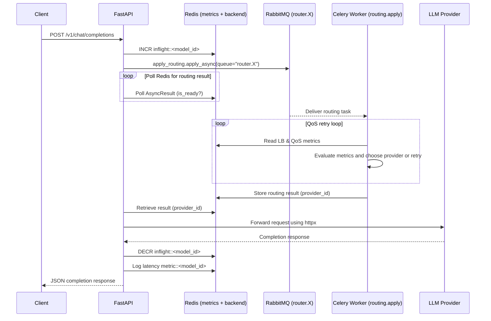

# Routing

The **Albert API** allows you to configure one or more external API providers for each model.  
These providers are defined in the configuration file (see [deployment](../deployment.md)).  
A single model can have multiple providers.

## Example Configuration

In the example below, the `turbo` model is configured with two providers: an OpenAI provider and a vLLM provider.  
The model can be called either using its ID (`turbo`) or using the alias defined in the `aliases` field (`turbo-alias`).

Each provider calls a different model, specified by the `model` field.  
For example, the OpenAI provider calls `gpt-3.5-turbo`, while the vLLM provider calls `meta-llama/Llama-3.1-8B-Instruct`.

> ❗️ **Important:**  
> When configuring multiple providers for a model, we strongly recommend that they are of the same type and call the same underlying model.  
> Otherwise, responses may have different structures.
```yaml
models:
  - id: turbo
    type: text-generation
    aliases: ['turbo-alias']
    load_balancing_strategy: least_busy
    providers:
      - model: gpt-3.5-turbo
        type: openai
        args:
          api_url: https://api.openai.com
          api_key: sk-...sA
          timeout: 60
      - model: meta-llama/Llama-3.1-8B-Instruct
        type: vllm
        args:
          api_url: http://localhost:8000
          api_key: sf...Df
          timeout: 60
```

## Code Logic

When the API starts, a `ModelRegistry` object is initialized.
This registry contains a `ModelRouter` for each model defined under models in the configuration file.
Each `ModelRouter` contains one or more `ModelProvider` objects, as specified in the providers list.
### ModelRegistry

ModelRegistry acts like a dictionary and allows retrieving a model by its ID or one of its aliases (see [deployment](../deployment.md)).

```python
from app.utils.lifespan import models

model = models["guillaumetell-7b"]
```

If the model does not exist, the API returns an HTTP 404 error (Model not found) instead of
raising a `KeyError`.

The returned object is a `ModelRouter`, which contains the model’s configuration and its associated providers.

### ModelRouter

The `ModelRouter` object stores the model configuration and its providers.
It exposes a `get_provider` method to select a provider for the model.

If multiple providers are available, the method selects one according to the configured `routing_strategy` 
(see [deployment](../deployment.md))..

The model information corresponds to what is returned by the GET /v1/models endpoint:

- `id` : model identifier used by providers
- `type` : model type (see [models](models.md))
- `aliases` : list of model aliases
- `max_context_length` : maximum input length supported by the model

```python
from app.utils.lifespan import models

model = models["guillaumetell-7b"]

provider = model.get_provider(endpoint="chat/completions")
```

The `endpoint` parameter is optional.
If not provided, `get_provider` checks that the model type is compatible with the requested endpoint.

### ModelProvider

`ModelProvider` is an `AsyncOpenAI`-like object that handles requests to the external API.
It exposes three main attributes:
- `api_url` : the external API URL
- `api_key` : the external API key
- `model` : the external model ID

Several `ModelProvider` subclasses exist, such as `VllmModelProvider` and `OpenAIModelProvider`.
Each defines an `ENDPOINT_TABLE` mapping the supported external API endpoints to Albert API endpoints.

## Routing strategies

### Shuffle

The `shuffle` strategy randomly distributes requests among available providers in a balanced way

---

# Celery-Based Routing

When Celery is enabled, routing moves from a synchronous API-side decision to an **asynchronous distributed routing layer**, allowing additional capabilities:

- dynamic QoS evaluation  
- rate/latency-aware provider scoring  
- congestion-aware rerouting  
- retrying failed routing attempts  
- distributing load across multiple workers  

Each model has **its own dedicated RabbitMQ routing queue** (e.g., `router.<model_id>`), ensuring isolation, per-model scaling, and preventing noisy-neighbor effects when some models receive more traffic.

Celery-based routing is optional and activated when the queuing subsystem is enabled.

---

# Celery Routing Workflow Diagram

Below is the **sequence diagram** representing the Celery-driven routing flow:



---

# Summary

Routing in the Albert API can operate in two modes:

1. **Local Routing**  
   - Provider selection is done synchronously inside the API  
   - Uses configured strategies (shuffle, round_robin, least_busy, etc.)

2. **Celery Routing**  
   - Provider selection is offloaded to Celery workers  
   - Workers use real-time Redis metrics  
   - Enables QoS scoring, retries, congestion handling, and distributed scalability  
   - API simply waits for the provider_id stored in Redis

For high availability, dynamic load balancing, or multi-provider setups, Celery-based routing is strongly recommended.
