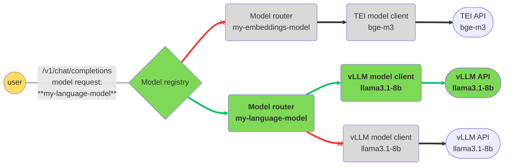
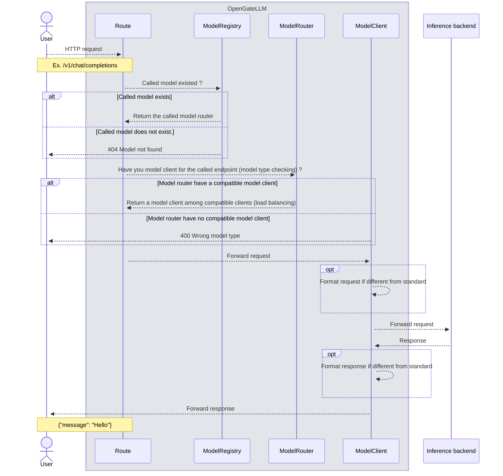

# Routing

The **Albert API** allows you to configure one or more external API clients for each model.  
These clients are defined in the configuration file (see [deployment](../deployment.md)).  
A single model can have multiple clients.

## Example Configuration

In the example below, the `turbo` model is configured with two clients: an OpenAI client and a vLLM client.  
The model can be called either using its ID (`turbo`) or using the alias defined in the `aliases` field (`turbo-alias`).

The routing strategy is set to `round_robin`, meaning that requests are distributed alternately between the two clients.  
For more details on routing strategies, see [deployment](../deployment.md).

Each client calls a different model, specified by the `model` field.  
For example, the OpenAI client calls `gpt-3.5-turbo`, while the vLLM client calls `meta-llama/Llama-3.1-8B-Instruct`.

> ❗️ **Important:**  
> When configuring multiple clients for a model, we strongly recommend that they are of the same type and call the same underlying model.  
> Otherwise, responses may have different structures.
```yaml
models:
  - id: turbo
    type: text-generation
    aliases: ['turbo-alias']
    routing_strategy: round_robin
    clients:
      - model: gpt-3.5-turbo
        type: openai
        args:
          api_url: https://api.openai.com
          api_key: sk-...sA
          timeout: 60
      - model: meta-llama/Llama-3.1-8B-Instruct
        type: vllm
        args:
          api_url: http://localhost:8000
          api_key: sf...Df
          timeout: 60
```

## Code Logic

When the API starts, a `ModelRegistry` object is initialized.
This registry contains a `ModelRouter` for each model defined under models in the configuration file.
Each `ModelRouter` contains one or more `ModelClient` objects, as specified in the clients list.
### ModelRegistry

ModelRegistry acts like a dictionary and allows retrieving a model by its ID or one of its aliases (see [deployment](../deployment.md)).

```python
from app.utils.lifespan import models

model = models["guillaumetell-7b"]
```

If the model does not exist, the API returns an HTTP 404 error (Model not found) instead of
raising a `KeyError`.

The returned object is a `ModelRouter`, which contains the model’s configuration and its associated clients.

### ModelRouter

The `ModelRouter` object stores the model configuration and its clients.
It exposes a `get_client` method to select a client for the model.

If multiple clients are available, the method selects one according to the configured `routing_strategy` 
(see [deployment](../deployment.md))..

The model information corresponds to what is returned by the GET /v1/models endpoint:

- `id` : model identifier used by clients
- `type` : model type (see [models](models.md))
- `aliases` : list of model aliases
- `max_context_length` : maximum input length supported by the model

```python
from app.utils.lifespan import models

model = models["guillaumetell-7b"]

client = model.get_client(endpoint="chat/completions")
```

The `endpoint` parameter is optional.
If not provided, `get_client` checks that the model type is compatible with the requested endpoint.

### ModelClient

`ModelClient` is an `AsyncOpenAI`-like object that handles requests to the external API.
It exposes three main attributes:
- `api_url` : the external API URL
- `api_key` : the external API key
- `model` : the external model ID

Several `ModelClient` subclasses exist, such as `VllmModelClient` and `OpenAIModelClient`.
Each defines an `ENDPOINT_TABLE` mapping the supported external API endpoints to Albert API endpoints.

## Routing strategies

### Shuffle

The `shuffle` strategy randomly distributes requests among available clients in a balanced way

### Round robin

The `round_robin` strategy alternates requests between clients in sequence.



