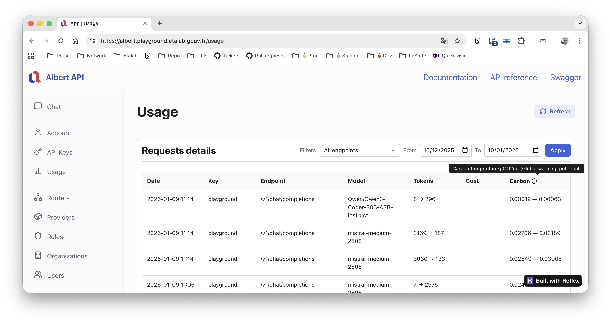

import { Aside, LinkButton, Tabs, TabItem } from '@astrojs/starlight/components';

OpenGateLLM tracks the environmental impact of AI model usage through the [EcoLogits](https://ecologits.ai) library, which provides a comprehensive view of the environmental footprint of generative AI models at inference.

The environmental footprint is deduced from the number of parameters of the model and the country where the model is hosted. For each model provider, you can define these parameters that impact the environmental footprint. Either through the *Provider settings* page in the Playground UI, or via the *config.yml* file. For more details on model configuration, see the [model setup documentation](/getting-started/models).

## Configuration

There are three way to configure environmental impact tracking, by Playground, API or configuration file.

<Tabs>
  <TabItem label="Playground UI" icon="lucide:laptop">
  
  To define model parameters in the Playground, go to the *Provider* page. Complete the form fields when you create or edit a model provider including:
  - **`Total params of the model`**: Total number of parameters of the model in billions of parameters for environmental footprint computation.
  - **`Active params of the model`**: Active number of parameters of the model in billions of parameters for environmental footprint computation.
  - **`Hosting country of the model`**: Hosting country of the model in ISO 3166-1 alpha-3 code format (e.g., `WOR` for World, `FRA` for France, `USA` for United States).

  <Aside type="note" title="Environmental footprint computation">
  Environmental footprint computation requires at least one of `Total params of the model` or `Active params of the model` to be defined. If not provided, the environmental impact will not be computed for that model provider (display as 0 kWh and 0 kgCO2eq).

  Environmental footprint is only supported for `text-generation` and `image-text-to-text` model types. For other model types, the environmental impact will not be computed (display as 0 kWh and 0 kgCO2eq).
  </Aside>

  </TabItem>

  <TabItem label="API" icon="lucide:code">
  See POST and PUT /v1/admin/providers endpoints for defining `model_total_params`, `model_active_params` and `model_hosting_zone` of a provider in API reference.
  
  <LinkButton href="/reference/" icon="external">API Reference</LinkButton>
  </TabItem>

  <TabItem value="config" label="Configuration file" icon="lucide:file-text">
  <Aside type="caution">
  We not recommend to use the configuration file to setup your models parameters, prefer to use the Playground UI or API endpoints.
  </Aside>

  To define model parameters in the configuration file, complete the following fields for environmental footprint computation for each model provider:
  - **`model_total_params`**: Total number of parameters of the model in billions of parameters for environmental footprint computation.
  - **`model_active_params`**: Active number of parameters of the model in billions of parameters for environmental footprint computation.
  - **`model_hosting_zone`**: Hosting zone of the model in ISO 3166-1 alpha-3 code format (e.g., `WOR` for World, `FRA` for France, `USA` for United States).

  **Example:**

  ```yaml
  models:
    [...]
    - name: my-language-model
      type: text-generation
      providers:
        - type: openai
          url: https://api.openai.com
          key: ${OPENAI_API_KEY}
          model_name: gpt-4o-mini
          model_total_params: 35
          model_active_params: 35
          model_hosting_zone: WOR
  ```

  <LinkButton href="/configuration/configuration_file/" icon="external">Configuration file documentation</LinkButton>

  <Aside type="note" title="Environmental footprint computation">
  Environmental footprint computation requires at least one of `model_total_params` or `model_active_params` to be defined. If not provided, the environmental impact will not be computed for that model provider (display as 0 kWh and 0 kgCO2eq).

  Environmental footprint is only supported for `text-generation` and `image-text-to-text` model types. For other model types, the environmental impact will not be computed (display as 0 kWh and 0 kgCO2eq).
  </Aside>
  </TabItem>
</Tabs>

## Environmental impact metrics

For each call to a generative AI model, the API returns environmental impact metrics in the response, in the `usage.carbon` field. The metrics include minimum and maximum estimates to account for variability in model efficiency:

- **kWh**: Energy consumption in kilowatt-hours (kWh), representing the final electricity consumption.
- **kgCO2eq**: Global Warming Potential (GWP) in kilograms of CO2 equivalent (kgCO2eq), representing greenhouse gas emissions related to climate change.

**Example response:**

```diff lang="json"
{
  "id": "chatcmpl-123",
  "object": "chat.completion",
  "created": 1677652288,
  "model": "my-language-model",
  "choices": [
    ...
  ],
  "usage": {
    "prompt_tokens": 10,
    "completion_tokens": 20,
    "total_tokens": 30,
    "cost": 0.000015,
+    "carbon": {"kWh": 0.0001456, "kgCO2eq": 0.0000672 }
  }
}
```

After the request is processed, the carbon footprint of the request is store in *usage* table by the [hooks decorator](https://github.com/etalab-ia/OpenGateLLM/blob/main/api/utils/hooks_decorator.py) attached to each endpoint. See [usage monitoring documentation](/features/usage/inference_monitoring/) for more information. 

You can also see the carbon footprint of the request in the *Usage* page of the Playground.



## How it works

Environmental impact is calculated using the [EcoLogits](https://ecologits.ai) library through the `compute_llm_impacts` function. The computation takes into account:

1. **Model parameters**: 
   - Total number of parameters (`model_total_params`)
   - Active number of parameters (`model_active_params`, defaults to total params if not specified)

2. **Token usage**: The number of output/completion tokens generated by the model

3. **Request latency**: The time taken for the inference request (in seconds)

4. **Electricity mix**: The carbon intensity of electricity based on the hosting zone (`model_hosting_zone`). The electricity mix includes:
   - ADPE (Abiotic Depletion Potential - elements)
   - PE (Primary Energy)
   - GWP (Global Warming Potential)

For more information about methodology, see [EcoLogits documentation](https://ecologits.ai/methodology).

:::note
If `total_params` is not defined or `token_count` is zero, the carbon footprint will be returned as zero for both energy and emissions.
:::

