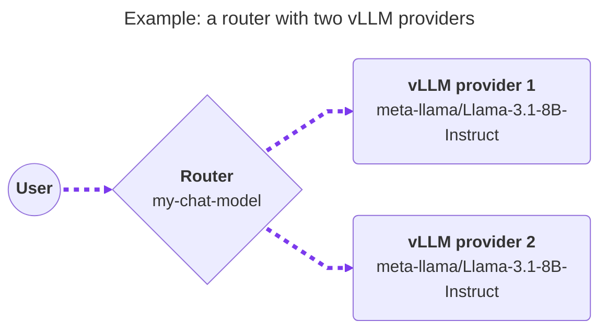
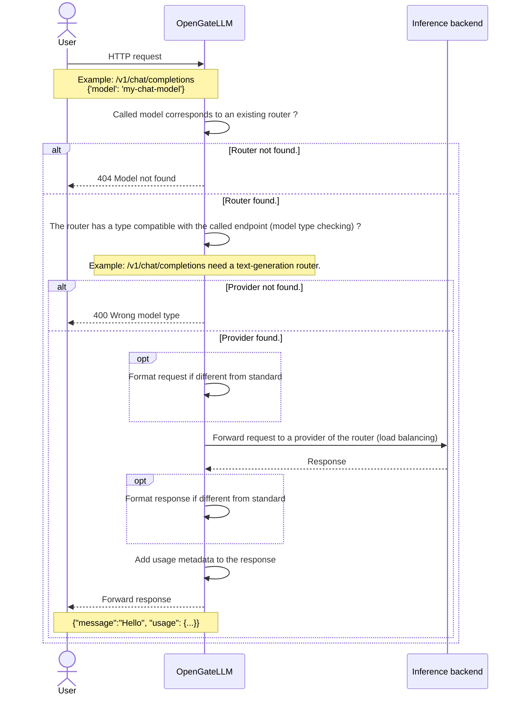

import { Aside, LinkButton, Steps, TabItem, Tabs } from '@astrojs/starlight/components';

## Concepts

In OpenGateLLM, a model is divided into two parts:
- **A router**: the model name visible to users (e.g. `my-chat-model`).
- **One or more providers APIs**: the real inference backends behind this router (vLLM, Ollama, OpenAI, Mistral, Hugging Face Text Embeddings Inference, etc.).

For a router, you define one or more providers APIs to serve the same model. 
You declare for each API provider associated to the router the model name on the provider side to call when a user calls the router.

When a user calls a router (`/v1/chat/completions`, `/v1/embeddings`, ...) with this name (e.g. `my-chat-model`), OpenGateLLM load-balances requests across its configured providers API.

The router name (model ID called by the user) can be the same or different from the model name (model name on the provider side).
You can define additional names for the same router using the `aliases` field.

In a same way, **all models of served by providers behind a router must be of the same**: same model name, same model type and same context length. 
But they can have provide by different API (e.g. one router with a vLLM API and Ollama API to serve the same model).
For example, you can have a router named `my-chat-model` with two providers, one using vLLM and the other using Ollama.

**To expose a model through OpenGateLLM, you need to configure a router and one or more providers APIs for this router.**

<Aside type="tip" title="Supported models">
Check the list of supported model provider APIs [here](/features/supported_models/).
</Aside>

## Request flow

## Configuration flow

1. Create a router.
2. Attach one or more providers to this router.
3. (Optional) Apply a rate limiting policy to the router.
   See [rate limiting](/features/usage/rate_limiting/).

<Tabs>
  <TabItem value="playground" label="Playground UI" icon="lucide:laptop">
  <Steps>
    <ol>
      <li>
        Open <strong>Routers</strong> and create a router:
        <ul>
          <li><code>name</code>: model name shown to users.</li>
          <li><code>type</code>: model type (for example <code>text-generation</code>).</li>
          <li><code>load_balancing_strategy</code>: <code>shuffle</code> (default) or <code>least_busy</code>.</li>
          <li><code>aliases</code> (optional): additional names for the same router.</li>
        </ul>
      </li>
      <li>
        Open <strong>Providers</strong> and create at least one provider linked to this router:
        <ul>
          <li><code>router</code>: router ID.</li>
          <li><code>type</code>: provider type.</li>
          <li><code>model_name</code>: real model name on the provider side.</li>
          <li><code>url</code> (optional for some provider types): provider base URL (domain only, without <code>/v1</code>).</li>
          <li><code>key</code> (optional): API key.</li>
          <li><code>timeout</code> (optional): request timeout in seconds.</li>
        </ul>
      </li>
    </ol>
  </Steps>
  </TabItem>

  <TabItem value="config" label="API" icon="lucide:code">
  <Steps>
    <ol>
      <li>
        Create a router.
        Use POST <code>/v1/admin/routers</code> endpoint.
      </li>
      <li>
        Create a provider with POST <code>/v1/admin/providers</code> endpoint.
      </li>
      <li>
        Verify configuration.
        Use GET <code>/v1/models</code> endpoint.
      </li>

      <LinkButton href="/reference/" icon="external">See API Reference</LinkButton>
    </ol>
  </Steps>
  </TabItem>

</Tabs>
