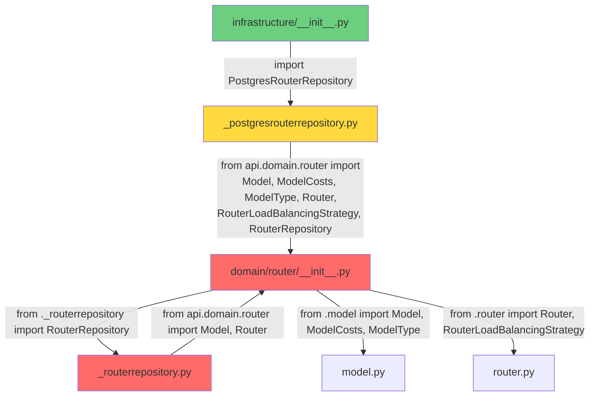

# Diagramme d'import circulaire



## Explication du cycle

Le problème se situe dans la chaîne d'import suivante :

1. **infrastructure/__init__.py** importe `PostgresRouterRepository`
2. **_postgresrouterrepository.py** importe depuis `api.domain.router`
3. **domain/router/__init__.py** commence à s'initialiser et importe `RouterRepository` depuis `_routerrepository.py`
4. **_routerrepository.py** essaie d'importer `Model` et `Router` depuis `api.domain.router`
5. ❌ **CYCLE** : `api.domain.router` n'est pas encore complètement initialisé car il attend la fin de l'import de `_routerrepository.py`

## Solution

Pour résoudre ce problème, `_routerrepository.py` devrait importer directement depuis les modules spécifiques plutôt que depuis le package `__init__.py` :

```python
# Au lieu de :
from api.domain.router import Model, Router

# Utiliser :
from api.domain.router import Model
from api.domain.router import Router
```

